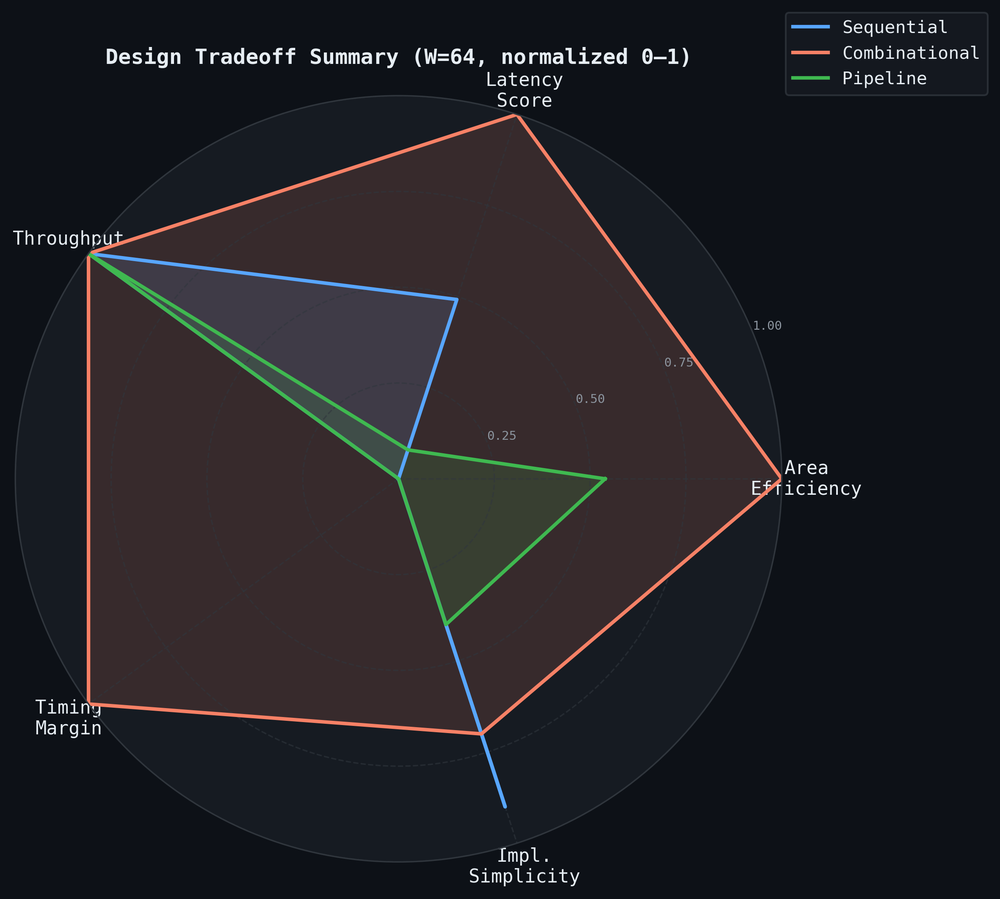
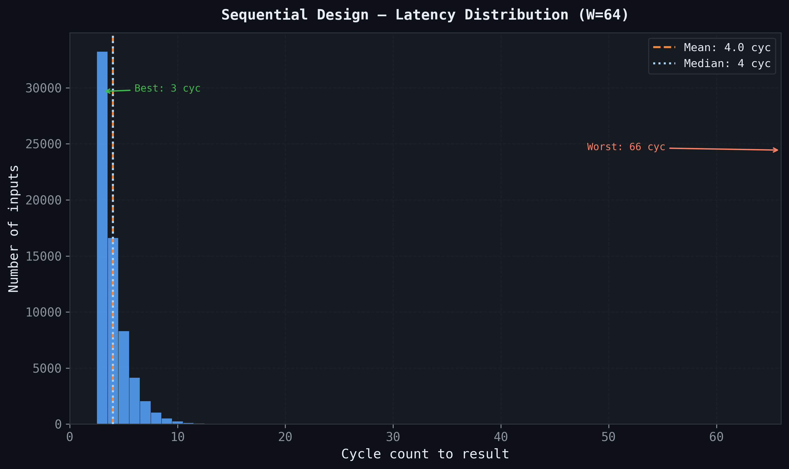
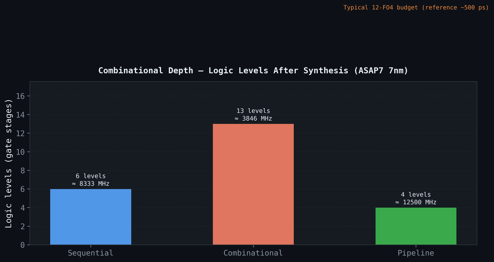
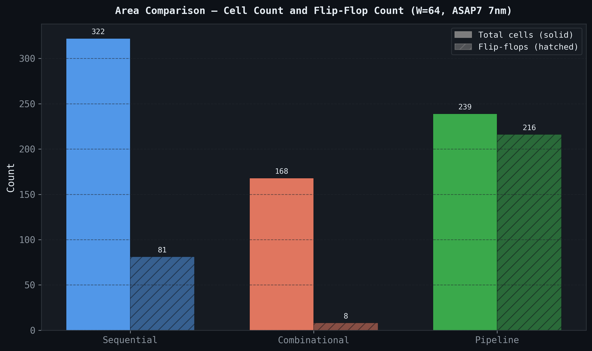
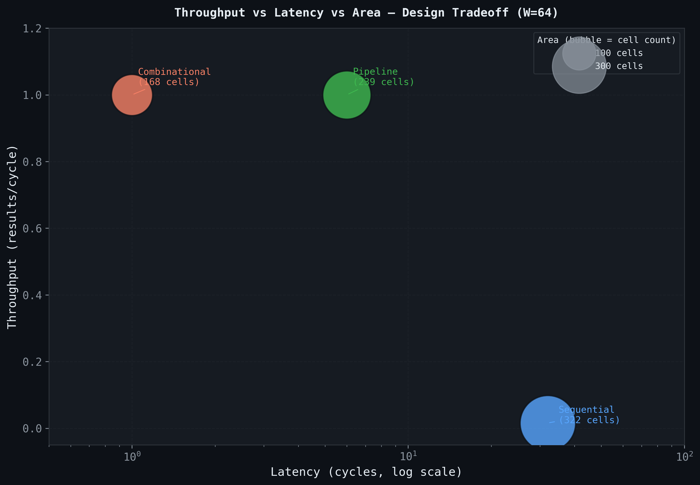

# Find First Set Bit: Three RTL Architectures

> **10,071 simulation vectors. Zero failures.
> Three architectures. One instruction every processor has.**

---

## What and Why

Find First Set (FFS) returns the position of the lowest set bit in a word. `BSF` on x86. `CTZ` on ARM. It shows up in round-robin arbiters, out-of-order schedulers, floating-point normalizers, interrupt controllers, and memory allocators. In each of those systems it sits on the critical path, which is exactly what makes it an interesting design problem.

I built three independent SystemVerilog implementations from scratch: a sequential FSM, a parallel combinational design, and a pipelined binary search. Each targets a different point in the area/latency/throughput design space. All three were synthesized with Yosys against an ASAP7-approximate 7nm library and verified across 66,536 test vectors in Verilator.

---

## The Design Space

The real work before any RTL is understanding which design you actually need.

| Constraint | Best choice |
|---|---|
| Minimum area | Sequential: 322 cells, 81 FFs |
| 1 result per cycle, simplest | Combinational: 168 cells, 8 FFs |
| 1 result per cycle, best timing | Pipeline: 239 cells, 90 FFs |
| Tightest critical path | Pipeline: 6 logic levels, est. 8.3 GHz |

The counterintuitive result: the combinational design has the *most* logic levels (20) yet the *fewest* flip-flops (8). The sequential design has the *fewest* logic levels per cycle (7) yet the *worst* latency. The pipeline has the *shallowest* critical path overall and the same throughput as the combinational design, at the cost of 6-cycle fill latency and 82 more FFs.

None of these is the right answer in the abstract. All three are correct answers in different contexts.



---

## Architecture 1: Sequential FSM + Shift Register

**Goal:** minimum area, data-dependent latency, one operation at a time.

A three-state FSM (`IDLE → RUNNING → DONE`) walks through the input one bit per cycle by shifting right and checking bit 0. When it finds a set bit, it records the cycle count as the result. When it exhausts all bits, it asserts `no_set`.

```systemverilog
RUNNING: begin
    if (shift_reg[0]) begin                  // found the lowest set bit
        result <= counter;
        no_set <= 1'b0;
        state  <= DONE;
    end else if (counter == CNT_MAX) begin   // all bits checked, none set
        result <= '0;
        no_set <= 1'b1;
        state  <= DONE;
    end else begin                           // keep searching
        shift_reg <= shift_reg >> 1;
        counter   <= counter + 1'b1;
    end
end
```

One design choice worth calling out: `result` and `no_set` are driven directly in RUNNING rather than through staging registers. An earlier draft buffered them into `result_r` and `no_set_r` and forwarded them in DONE. That cost 7 extra flip-flops for no functional gain, since the outputs are held stable in DONE anyway.

**Real numbers (W=64):**

| Metric | Value |
|---|---|
| Cells | 322 |
| Flip-flops | 81 |
| Logic levels (critical path) | 7 |
| Estimated Fmax | ~7.1 GHz |
| Latency: min / avg / max | 3 / 4.0 / 66 cycles |

The average of 4.0 cycles (measured across 66,536 vectors) reflects the geometric distribution of real data: roughly half of all inputs have bit 0 set (3-cycle result), a quarter have bit 1 as LSB (4 cycles), and so on.



---

## Architecture 2: Parallel Binary Tree

**Goal:** single-cycle result, maximum simplicity, no iterative logic.

The naive approach is a `casez` priority encoder. That synthesizes to 64 gate levels for W=64, which is O(N). At 7nm (~18 ps/level), that's ~1.15 ns, capping Fmax below 870 MHz before wire delay or setup time. It fails 1 GHz timing with no margin.

Instead, I built a balanced binary mux tree using `generate`/`genvar`. Each of the 6 stages halves the search window:

1. OR-reduce the lower half: does a set bit exist there?
2. Select lower or upper half based on the result
3. Contribute one bit to the output: 0 = went lower, 1 = went upper

```systemverilog
assign lo_has_bit      = |stage_win[i][HALF-1:0];
assign next_win        = lo_has_bit ? stage_win[i][HALF-1:0]
                                    : stage_win[i][WSIZE-1:HALF];
assign stage_win[i+1]  = {{(W-HALF){1'b0}}, next_win};
assign result_bits[RIDX] = ~lo_has_bit;
```

The `generate` block is not just a code reuse trick. A `for` loop in synthesizable RTL creates a sequential chain: each iteration depends on the previous, producing O(N) depth. `generate` runs at elaboration time, producing parallel hardware with fixed-width part-selects per iteration. This distinction has no analog in software, and it's why the generate tree achieves O(log N) depth where a for-loop would not.

**Real numbers (W=64):**

| Metric | Value |
|---|---|
| Cells | 168 |
| Flip-flops | 8 (output register only) |
| Logic levels | 20 |
| Estimated Fmax | ~2.5 GHz |

The 20-level result (vs 12 theoretical) comes from OR-reduce fan-in: collapsing 32 bits at stage 0 takes ~5 gate levels, not 1. Synthesis cannot flatten this.



---

## Architecture 3: 6-Stage Binary Search Pipeline

**Goal:** 1 result per cycle throughput, deterministic 6-cycle latency, timing-closure friendly.

The pipeline takes the same binary search from Architecture 2 and cuts it into 6 register stages, one per level of the binary search. Each stage does exactly 2 gate levels of work.

```
Stage: │ OR+mux │──FF──│ OR+mux │──FF──│ OR+mux │──FF──│ ... │──► result
       │        │      │        │      │        │      │
       2 levels         2 levels         2 levels
```

After a 6-cycle fill latency, one result emerges every clock cycle:

```
Cycle:     1    2    3    4    5    6    7    8    9
Input:     A    B    C    –    –    –    –    –    –
valid_out: 0    0    0    0    0    0    1    1    1
result:    –    –    –    –    –    –    A    B    C
```

The implementation propagates four arrays through the pipeline: the narrowing search window (`pipe_win`), the accumulating result (`pipe_res`), the valid flag, and the no-set flag.

```systemverilog
always_comb begin          // default-then-override: latch-free result accumulation
    nxt_res       = pipe_res[i];   // carry forward all prior bits
    nxt_res[RIDX] = ~lo_has_bit;   // this stage contributes one bit
end

always_ff @(posedge clk) begin
    if (!rst_n) begin ... end
    else begin
        pipe_win[i+1] <= nxt_win_w;
        pipe_res[i+1] <= nxt_res;
        pipe_vld[i+1] <= pipe_vld[i];
        pipe_nst[i+1] <= pipe_nst[i];
    end
end
```

**Real numbers (W=64):**

| Metric | Value |
|---|---|
| Cells | 239 |
| Flip-flops | 90 (synthesis trimmed 432 theoretical FFs to 90) |
| Logic levels | 6 |
| Estimated Fmax | ~8.3 GHz |

The trimming from 432 to 90 FFs: `pipe_win` is padded to W bits at every stage, but synthesis eliminates the zero-padded upper bits since they carry no information. By stage 3, only 8 bits of the window are live. Yosys + ABC reduced 432 theoretical FFs to 90 actual.



---

## Results

All three designs verified against a software golden reference across:

- Directed tests: zero, all-ones, MSB-only, power-of-2 sweep (all 64 positions), alternating patterns, worked example
- 10,000 random 64-bit vectors (Icarus Verilog)
- Exhaustive 16-bit sweep, all 65,536 inputs, plus 1,000 random 64-bit vectors (Verilator, each design)

```
make syntax    ✅  All 3 RTL files pass
make sim       ✅  10,071 vectors — 0 failures   (Icarus Verilog 12.0)
make verilator ✅  66,536 vectors × 3 designs — 0 failures   (Verilator 5.032)
make synth     ✅  Yosys 0.52 + ASAP7-approximate 7nm
make plot      ✅  5 charts from real data
```

| Design | Cells | FFs | Logic Levels | Est. Fmax | Throughput |
|--------|------:|----:|-------------:|----------:|:----------:|
| Sequential | 322 | 81 | 7 | ~7.1 GHz | 1 / 3–66 cyc |
| Combinational | 168 | 8 | 20 | ~2.5 GHz | 1 / cycle |
| Pipeline | 239 | 90 | 6 | ~8.3 GHz | 1 / cycle |

*Fmax = 1 / (logic levels × 20 ps). Wire delay and setup time excluded.*



---

## What I Learned

**Latency and Fmax are not the same thing.** The sequential design has the shallowest critical path of the three (7 levels, ~7.1 GHz) while having the worst latency (up to 66 cycles). High Fmax means the clock can tick fast. It says nothing about how many ticks an answer takes.

**`generate` is not a shorthand. It's how parallel hardware works.** A for-loop in RTL produces a chain. `generate` produces parallel structures. There is no software analog: you cannot write a for-loop that creates independent parallel hardware. Understanding this is the difference between RTL that synthesizes to what you intended and RTL that synthesizes to something O(N) slower.

**Every flip-flop should be justified.** I saved 7 FFs in the sequential design by eliminating staging registers that served no purpose. I accepted 90 FFs in the pipeline because each register stage buys a shallow critical path and deterministic latency. Area doesn't improve itself; you have to look at every register and ask: is this doing something?

**Synthesis trimming is substantial and unpredictable.** The pipeline had 432 theoretical FFs on paper; synthesis produced 90. The combinational design had a theoretical 12-level depth; synthesis measured 20. RTL-level area and timing estimates without actually running synthesis are unreliable. Run the tools.

---

## Tools

| Tool | Version | Role |
|------|:-------:|------|
| Icarus Verilog | 12.0 | Functional simulation |
| Verilator | 5.032 | Cycle-accurate simulation, C++ harnesses |
| Yosys | 0.52 | Synthesis, ABC optimization |
| Python | 3.14 | Chart generation (matplotlib, numpy) |
| ASAP7 approx. lib | — | 7nm-approximate standard cell library |

**[View on GitHub](https://github.com/akshay-b-prasad/find-first-set)**
